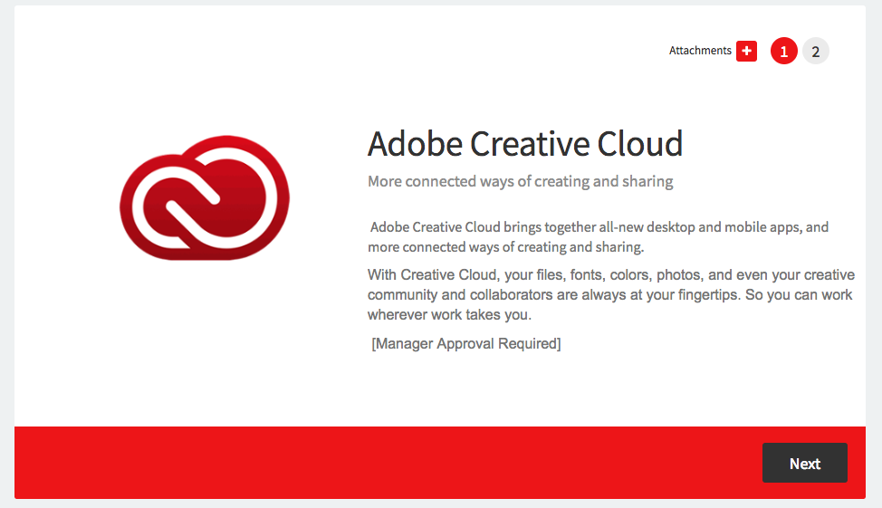
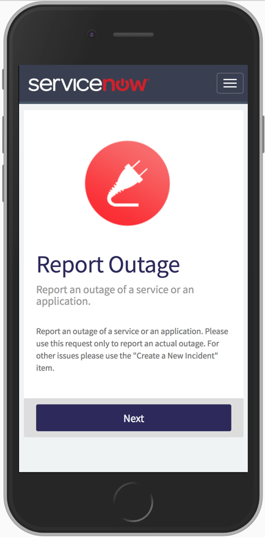

# Use Case
The Multi-Screen Catalog Item Widget allows catalog items to be broken up into smaller sections enabling a better user experience for your requestors. Walk your users slowly and painlessly through a larger catalog items instead of bombarding them with tens of variables at once! The widget applies a clean, modern look and retains all of the core functionality of the out-of-box widget.

The widget works with standard catalog items as well as record producers. Upon opening any catalog item, the user will be presented with a display screen (picture, short description, and description) for the item before being prompted to fill in the item variables.

The widget is easily configurable with instance options and the colors can easily be change to meet any company palette with the use of SASS variables. 

# Screenshots
The original color scheme:

Each new screen displays the next group of variables within the catalog item's containers.

With a few quick changes the widget's CSS-SASS variables, you can apply a whole new color palette to the widget.

Changes to the color palette within the widget editor:

The widget has a responsive design to fit any screen size:

# Implementation
# Demo Data
# Best Practice
