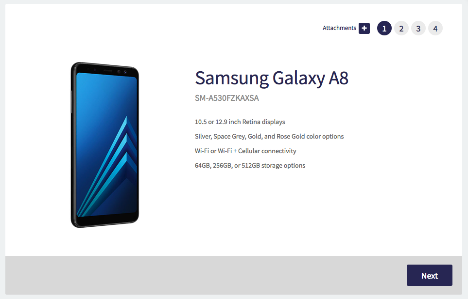
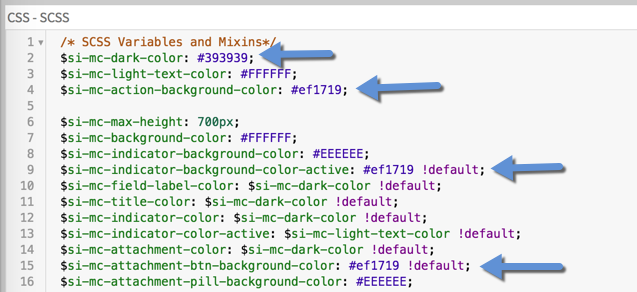

# Use Case
The Multi-Screen Catalog Item Widget allows catalog items to be broken up into smaller sections enabling a better user experience for your requestors. Walk your users slowly and painlessly through a larger catalog items instead of bombarding them with tens of variables at once! The widget applies a clean, modern look and retains all of the core functionality of the out-of-box widget.

The widget works with standard catalog items as well as record producers. Upon opening any catalog item, the user will be presented with a display screen (picture, short description, and description) for the item before being prompted to fill in the item variables.

The widget is easily configurable with instance options and the colors can easily be change to meet any company palette with the use of SASS variables. 

# Screenshots
The original color scheme:

Each new screen displays the next group of variables within the catalog item's containers.

With a few quick changes the widget's CSS-SASS variables, you can apply a whole new color palette to the widget.

Changes to the color palette within the widget editor:

# Implementation
**Import the Multi-Screen Catalog Item Widget to your instance:**
1. Open Studio on your instance.
2. In the **Load Application** dialog, choose **Import From Source Control**
3. Add the following to the **URL** field and click **Import** - `https://github.com/jtandy13/multi-screen-catalog-item-widget.git`

**Demo the widget with two pre-configured catalog items guaranteed to look great:**
1. Open Studio on your instance.
2. In the **Load Application** dialog, choose **Import From Source Control**
3. Add the following to the **URL** field and click **Import** - `https://github.com/jtandy13/multi-screen-catalog-item-demo-items.git`
4. You can demo the two widgets on the new `multicat` Service Portal page with the following urls:
`https://your-instance.service-now.com/sp?id=multicat&sys_id=f0a99c7adb726300f530c6fc349619fe`
`https://your-instance.service-now.com/sp?id=multicat&sys_id=39a5ec32dbb26300f530c6fc34961972`

**Demo a custom catalog item using the Multi-Screen Catalog Item Widget**
1. Add a high definition image to the **Picture** field of the catalog item you are using.
2. Make sure that the catalog item has a filled-out Short Description and Description.
3. Add **Container Start** and **Container End** variables around groups of variables. This will form the different screens of variables in the widget. 
4. Make sure that the **Container Start** variables all display a title. These will be the headings for each screen in the widget.
5. Demo the custom catalog item using the `multicat` Service Portal page with the following url:
`https://your-instance.service-now.com/sp?id=multicat&sys_id=sys_id-of-your-cat-item`

**Use the Multi-Screen Catalog Item Widget as the default widget for all catalog items**
1. Make sure that all of your catalog items follow the best practice advice below.
2. Open the `sc_cat_item` Service Portal page in the Service Portal Page Designer with the following url: `https://your-instance.service-now.com/$spd.do#/sp/editor/sc_cat_item/e2656985ff630200ba13ffffffffff68`
3. Remove the **SC Catalog Item** widget from the page replacing it with the **Multi-Screen Catalog Item** widget.

# Widget Instance Options
- "Show Delivery Time" (yes/no)
- "Show Price" (yes/no)
- "Show Add Cart Button" (yes/no)
- "Redirect Page on Order Now" (Service Portal Page)
- "Redirect Page on Submit" (Service Portal Page)

# Best Practice
- All catalog items must have a high definition image.
- All catalog items must have a filled-out Short Description and Description field.
- Catalog items with more than five variables should be grouped by **Container Start** and **Container End** variables.
- **Container Start** variables should all display a title.
